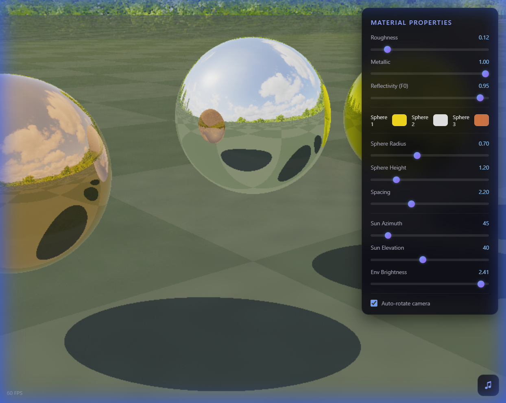

# 🔮 Metallic Spheres — Real-Time Ray Tracing

A stunning **real-time ray tracing** simulation of metallic spheres rendered entirely in the browser using **WebGL2**. Three PBR metallic spheres float inside a photographic HDR environment with interactive material controls and generative ambient music — all packed into a **single standalone HTML file**.



## ✨ Features

| Feature                         | Description                                                                                                 |
| ------------------------------- | ----------------------------------------------------------------------------------------------------------- |
| 🎯 **Real-Time Ray Tracing**    | Analytical ray-sphere intersections with multi-bounce reflections at 60 FPS                                 |
| 🌍 **HDR Environment**          | Equirectangular panorama from [Polyhaven](https://polyhaven.com) (CC0 license) with procedural sky fallback |
| ⚙️ **PBR Materials**            | Cook-Torrance BRDF with adjustable roughness, metallic, and reflectivity                                    |
| 🎨 **Customizable Colors**      | Independent color pickers for each sphere (default: gold, silver, copper)                                   |
| ☀️ **Dynamic Lighting**         | Adjustable sun direction (azimuth + elevation) and environment brightness                                   |
| 🎵 **Generative Ambient Music** | Procedural pentatonic arpeggios with reverb, delay, and stereo panning via Web Audio API                    |
| 🔇 **Audio Toggle**             | Mute/unmute button with smooth volume fade                                                                  |
| 📱 **Touch Support**            | Full touch controls for mobile devices                                                                      |
| 🎥 **Camera Controls**          | Orbit (mouse drag), zoom (scroll), and auto-rotate toggle                                                   |

## 🚀 Getting Started

### Option 1: Just Open It

1. Download `index.html`
2. Open it in any modern browser (Chrome, Firefox, Edge, Safari)
3. That's it — no build step, no dependencies, no server required

### Option 2: Local Server

```bash
# If you prefer using a local server
npx serve .
# or
python -m http.server 8000
```

> **Note:** The environment panorama loads from Polyhaven's CDN, so an internet connection is needed for the HDRI background. Without internet, a vivid procedural sky is used as fallback.

## 🎮 Controls

### Camera

| Input              | Action                           |
| ------------------ | -------------------------------- |
| 🖱️ **Drag**        | Orbit around spheres             |
| 🔄 **Scroll**      | Zoom in/out                      |
| ✅ **Auto-rotate** | Toggle automatic camera rotation |

### Material Properties

| Slider           | Range | Effect                                         |
| ---------------- | ----- | ---------------------------------------------- |
| **Roughness**    | 0 → 1 | Mirror-smooth to fully diffuse                 |
| **Metallic**     | 0 → 1 | Dielectric to fully metallic                   |
| **Reflectivity** | 0 → 1 | No reflections to full environment reflections |

### Scene Controls

- **Sphere colors** — independent color pickers for each sphere
- **Radius / Height / Spacing** — adjust sphere geometry
- **Sun Azimuth & Elevation** — move the directional light
- **Env Brightness** — scale the environment map intensity

### Audio

Click the **♪** button (bottom-right) to start the ambient music. Click again to mute/unmute.

## 🛠️ Technical Details

### Architecture

Everything lives in a single `index.html` file:

- **HTML/CSS** — UI controls, loading overlay, responsive layout
- **GLSL Fragment Shader** — full-screen ray tracing via WebGL2
- **JavaScript** — shader compilation, camera, controls, environment loading, and audio

### Rendering Pipeline

1. **Full-screen quad** rendered with a fragment shader
2. **Analytical ray-sphere intersections** (not SDF marching — much faster)
3. **Cook-Torrance PBR** with GGX normal distribution, Smith geometry, Schlick fresnel
4. **Multi-bounce reflections** — spheres reflect each other and the environment
5. **Filmic tone mapping** (`1 - exp(-x)`) with saturation boost for vivid output
6. Rendered at **65% resolution** then upscaled for smooth 60 FPS

### Audio System

Generative ambient music using the **Web Audio API**:

- Pentatonic scale arpeggios over I→IV→V→vi chord progressions
- Dual detuned oscillators (sine + triangle) per note for warmth
- Convolution reverb with 3-second impulse response
- Delay line with lowpass-filtered feedback
- Stereo panning for spatial depth
- Subtle bass drones (C2 + G2) with LFO volume modulation
- Pink noise layer for atmospheric wind texture

### Environment Map

- Source: [Polyhaven](https://polyhaven.com) — CC0 Public Domain
- Format: Equirectangular JPEG (tonemapped)
- Multiple fallback URLs with graceful degradation to procedural sky

## 📋 Requirements

- Modern browser with **WebGL 2.0** support
- Internet connection (for HDRI environment loading; optional—procedural fallback available)
- No build tools, frameworks, or dependencies needed

## 📄 License

MIT License — feel free to use, modify, and distribute.

Environment maps are sourced from [Polyhaven](https://polyhaven.com) under [CC0 1.0 Universal](https://creativecommons.org/publicdomain/zero/1.0/) (public domain).

---

<p align="center">
  Made with WebGL2, GLSL, and the Web Audio API ✨
</p>
